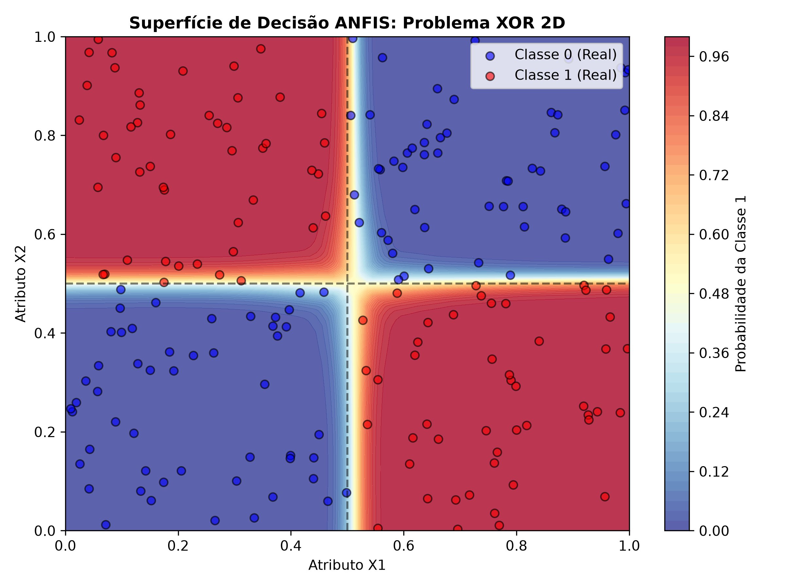

# FuzzyMethods 📊

Este repositório contém implementações e experimentações com sistemas baseados em lógica fuzzy voltados para a aproximação de funções não-lineares, regressão e análise preditiva. O foco principal é a validação de algoritmos de extração automática de regras fuzzy e redes neuro-fuzzy a partir de dados numéricos.

## 🔬 Modelos Implementados e Experimentos

### 1. Modelo de Wang-Mendel (`WMModel`)

O método clássico de **Wang-Mendel (WM)** foi projetado para mapear espaços de entrada e saída gerando uma base de conhecimento fuzzy inteligível e simbólica.

- **Particionamento:** Dinâmico por universo de discurso utilizando **5 funções de pertinência triangulares** baseadas nos quantis estatísticos dos dados (`min`, `q25`, `q50`, `q75`, `max`).
- **T-norma de Antecedentes:** Produto (conjunção fuzzy).
- **Defuzzificação:** Centro de área ponderado (Média Ponderada).
- **Motor de Extrapolação:** Mecanismo adaptativo de busca geométrica por vizinhança. Quando uma combinação do espaço de fases não possui dados reais no treino, o modelo varre o hiperespaço buscando regras vizinhas que compartilham exatamente $N-1$ antecedentes comuns. A predição do consequente é calculada pela distância euclidiana dos centros geométricos das funções de pertinência, ponderada pelo grau de certeza (`DOC`).

### 2. ANFIS (Adaptive Neuro-Fuzzy Inference System)

Implementação de uma rede neuro-fuzzy baseada na arquitetura de Takagi-Sugeno. Ao contrário do Wang-Mendel (que extrai regras estáticas de forma puramente axiomática e geométrica), o **ANFIS** utiliza uma estrutura de rede neural para otimizar os parâmetros das funções de pertinência (precedentes) e os coeficientes lineares (consequentes) através de algoritmos de aprendizado (gradiente descente/ajuste híbrido). No ANFIS é utilizada a **T-norma de Antecedentes** com função mínimo.

### 3. O Problema do XOR Fuzzy

Para testar os limites de separabilidade linear e mapeamento de topologias lógicas, os modelos foram submetidos ao clássico problema do **XOR** (Ou Exclusivo).

Por ser um problema geometricamente não-linear e não-separável por uma única linha reta, o XOR serve como prova de conceito fundamental para validar se a granularidade das regras fuzzy e a sobreposição das funções de pertinência conseguem criar uma superfície de decisão capaz de isolar os quadrantes lógicos do problema.

O XOR foi testado apenas com o ANFIS, o que mostrou um resultado satisfatório.



---

## 📈 Benchmarks e Testes Dinâmicos

### Narendra-Li (Aproximação Caótica)

Para estressar e validar a capacidade do modelo de capturar dinâmicas caóticas e não-lineares severas, utilizamos o clássico benchmark de **Narendra-Li**.

O dataset foi estruturado em uma janela temporal autoregressiva (LAG) mapeando 5 variáveis de entrada para prever o sinal dinâmico contínuo:

- **Inputs ($X$):** $y_t, y_{t-1}, y_{t-2}, u_t, u_{t-1}$
- **Target ($y$):** Sinal contínuo não-linear no tempo.

---

## 📁 Estrutura do Projeto

```text
├── fuzzy_model.py     # Definição do WMModel com a lógica de extrapolação de regras
├── utils.py           # Funções matemáticas de pertinência (trimf), inferência e salvamento
├── teste_narendra_li.py # Script de treinamento e avaliação do benchmark Narendra-Li
├── validacao_xor.py     # Script de treinamento e validação para problema XOR
├── pyproject.toml     # Configurações do projeto e definição de dependências (uv)
└── logs/              # Logs estruturados das simulações, métricas JSON e tabelas CSV
```
